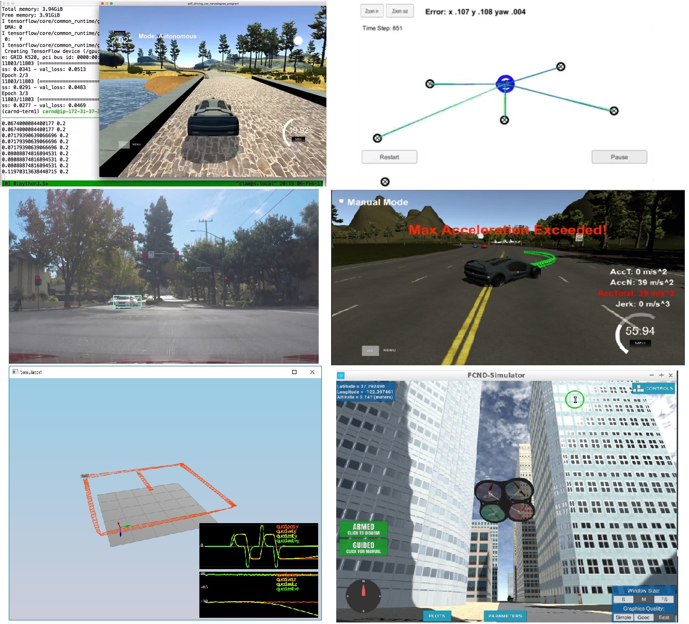

<h1 align="center">
  <br>
  <a href="https://github.com/VinBots/robots_clp"></a>
</h1>

<h4 align="center">A Suite of Projects in Controls, Localization and Planning in Robotics </h4>
<p align="center">
  <a href="#about">About</a> •
  <a href="#learning">Learning</a> •
  <a href="#installation">Installation</a> •
  <a href="#configuration">Configuration</a> •
  <a href="#references">References</a> •
  <a href="#credits">Credits</a> •
  <a href="#going-further">Going Further</a>
</p>

---

<h1 align="center">
  <br>
  <a href="https://github.com/VinBots/robots_clp"></a>
</h1>
<h5 align="center">Examples for behavioral cloning, particle filter, object detection, trajectory generation, 3D controls and 3D motion planning</h2>

## About

This repository includes a series of algorithms used in robotics, mainly self-driving vehicles and drones, for controls, localization and planning.

* **[Controls](controls/)** 
  * PID Control of a car in 2D
  * Cascaded PID controller for 3D  motions (positions, velocities,  accelerations and pitch, roll, yaw orientations) of a quadcopter
  * Behavioral cloning: End-to-end learning (from pixel  to action) for predicting   steering angle of a vehicle  solely based on camera  images

* **Localization /  Tracking**
  *  Given a map, some initial localization data (like a GPS)  and at each time step, some  observation and control data,  estimation of the localization of  the vehicle; 
  *  tracking a bicycle's  position and velocity using lidar  and radar measurements

* **Planning**
  * Design of smooth, safe paths  for a car to follow along a 3  
lane highway with traffic, using  localization, sensor fusion, and  map data; 
  * 3D motion planner  for a quadcopter

## Learning

* Deep Learning (mainly computer vision, convolutional neural networks, SSD MobileNet, OpenCV)
* Particle filter, Extended  Kalman filter
* Sensor fusion
* Search
* Prediction
* Trajectory  generation
* Grid and/or  graph  representations
* Basic geometry / Basic physics  (Forces /  Moments /  Transformations)

## Installation

**1. Clone the repository**

```
git clone https://github.com/VinBots/world_models.git
```

**2. Create and activate a new virtual environment via conda**

```
conda create --name new_env python=3.6.13
conda activate new_env
```

**3. Install the required packages**

Go to the root directory and install the dependencies
```
cd world_models
pip install -r requirements.txt
```
**4. Run the algorithm**
```
python src/main.py
```

## Configuration

Please refer to each project

## References

* This research paper goes into how to detect curves and will also help in detecting faded lanes. It uses an extended version of hough lines algorithm to detect tangents to the curve which can help you detect the curve. http://airccj.org/CSCP/vol5/csit53211.pdf
* 


## Credits

* Udacity [Self-Driving Car Engineer Nanodegree](https://www.udacity.com/course/self-driving-car-engineer-nanodegree--nd013) program.  
* Udacity [Flying Car and Autonomous Flight Engineer Nanodegree](https://www.udacity.com/course/flying-car-nanodegree--nd787) program. 


## Going Further

* real-life applications with more noisy data