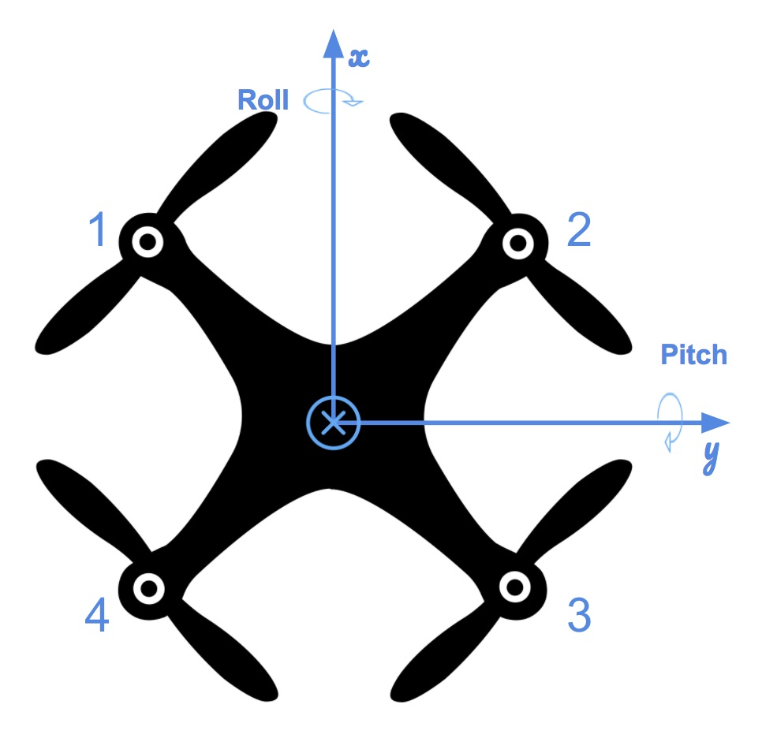
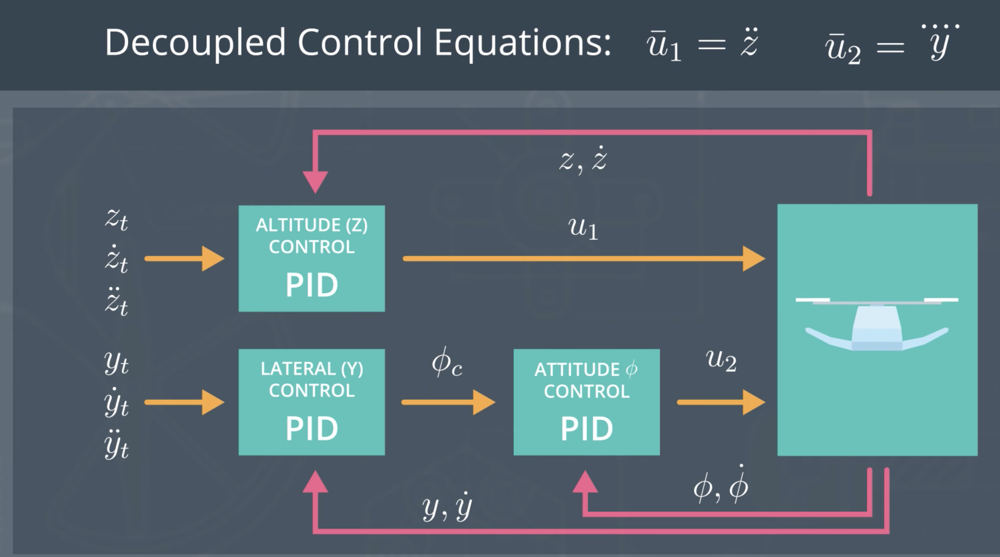
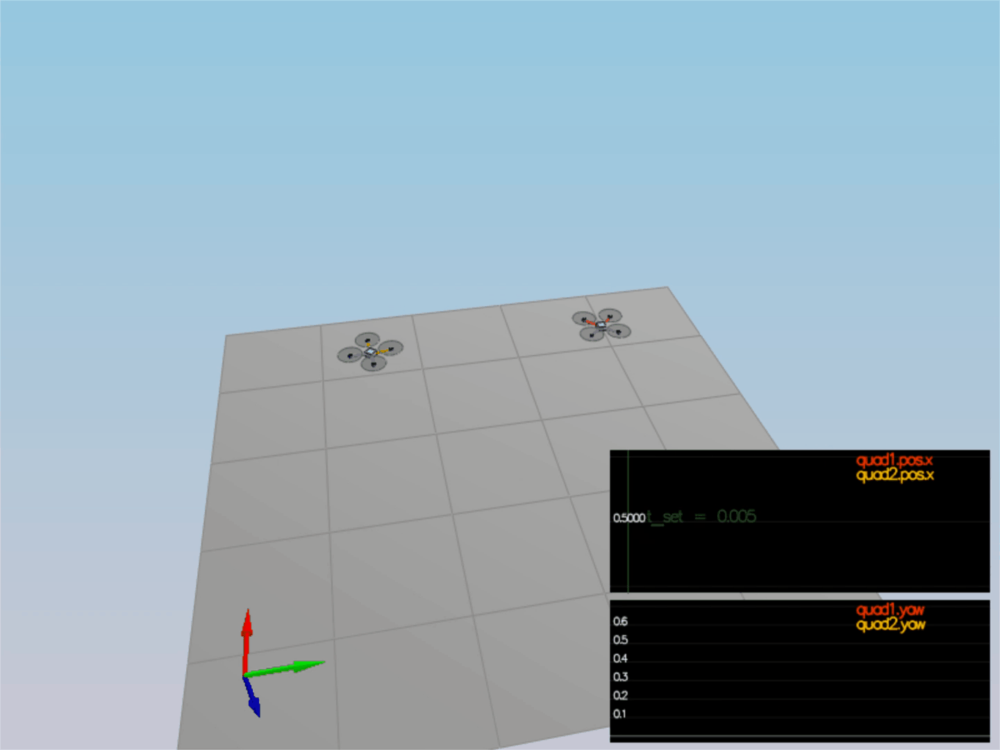

<h1 align="center">
  <br>
  </a>
</h1>

<h4 align="center">3D PID Cascaded Control</h4>
<p align="center">
  <a href="#about">About</a> •
  <a href="#results">Results</a> •
  <a href="#installation">Installation</a> •
  <a href="#configuration">Configuration</a> •
  <a href="#references">References</a> •
  <a href="#credits">Credits</a> •
  <a href="#going-further">Going Further</a>
</p>

---
<h1 align="center">
  <br>
  <a href=""></a>
</h1>
<h5 align="center">Controlling a quadcopter in 3D (with PID)</h2>


## About

We will be building a controller in C++.  We will be implementing and tuning this controller in several steps.


### Set the correct mass (Scenario 1)

I adjusted the mass of the drone to 0.5 so that it hovers when the total thrust of the propellers is equal to the force of gravity (F = mg or mg/4 for each of the 4 propellers)

### Body rate and roll/pitch control (scenario 2)

First, we implement the body rate and roll / pitch control.  For the simulation, we will use `Scenario 2`.  In this scenario, we will see a quad above the origin.  It is created with a small initial rotation speed about its roll axis.  The controller will need to stabilize the rotational motion and bring the vehicle back to level attitude.

To accomplish this, we will:

1. **Implement body rate control**

 - implement the code in the function `GenerateMotorCommands()`

 Here, the problem is: given the total thrust $F_T$ and the moments $M_x$, $M_y$, $M_z$, we need to calculate the thrust to apply to each propeller ($F_1, F_2, F_3, F_4$). We have 4 equations with 4 unknown variables:
 
* $F_T = F_1 + F_2 + F_3 + F_4$
* $Mx = (F1 + F4 - F2 - F3).l$
* $My = (F1 + F2 - F3 - F4).l$
* $Mz = -(F1 - F2 + F3 - F4).kappa$

We easily solve for $F_1, F_2, F_3, F_4$ by adding and/or substracting each equation.
 
 - implement the code in the function `BodyRateControl()`

Here, we will calculate a desired 3-axis moment given a desired and current body rate.
We use a proportional controller to adjust the angular rotation rates p, q, and r and then multiply by the moment of inertia Ixx, Iyy, Izz (as a reminder, $M = I.\alpha$)
 
 - Tune `kpPQR` in `QuadControlParams.txt` to get the vehicle to stop spinning quickly but not overshoot
 `KpPQR` was set at around 90, 90, 6

If successful, you should see the rotation of the vehicle about roll (omega.x) get controlled to 0 while other rates remain zero.  Note that the vehicle will keep flying off quite quickly, since the angle is not yet being controlled back to 0.  Also note that some overshoot will happen due to motor dynamics!.

If you come back to this step after the next step, you can try tuning just the body rate omega (without the outside angle controller) by setting `QuadControlParams.kpBank = 0`.

2. **Implement roll / pitch control**
We won't be worrying about yaw just yet.

 - implement the code in the function `RollPitchControl()`
Here, we will calculate a desired pitch and roll angle rates `pqrCmd` based on a desired global lateral acceleration `accelCmd`, the current attitude of the quad `attitude` in quaternions, and desired collective thrust command `collThrustCmd`
 
1. We first define $b^x$ and $b^y$ as the rotation matrix elements $R_{13}$ and $R_{23}$ - note that we access these elements by calling respectively R(0,2) and R(1,2)

Target $b^x_c = \ddot x / c$ with $c = \frac{F_T}{mass}$
Target $b^y_c = \ddot y / c$ with $c = \frac{F_T}{mass}$

Actual $b^x_a = R_{13}$
Actual $b^y_a = R_{23}$


2. Then, we use a P controller (with KpBank as the proportional factor to tune) to determine the desired rate of change of the rotation matrix elements, called $\dot b^x_c$ and $\dot b^y_c$

3. Finally, we calculate $p_c$ and $q_c$, the angular velocities in the body frame, by applying a matrix multiplication (see formula in code)
 
We will leave the yaw rate at 0.
 
 - Tune `kpBank` in `QuadControlParams.txt` to minimize settling time but avoid too much overshoot

`kpBank = 10` achieves the desired outcome

If successful you should now see the quad level itself (as shown below), though it’ll still be flying away slowly since we’re not controlling velocity/position!  You should also see the vehicle angle (Roll) get controlled to 0.

<p align="center">

</p>


### Position/velocity and yaw angle control (scenario 3) ###

Next, we will implement the position, altitude and yaw control for the quad.  For the simulation, we will use `Scenario 3`.  This will create 2 identical quads, one offset from its target point (but initialized with yaw = 0) and second offset from target point but yaw = 45 degrees.

 - implement the code in the function `LateralPositionControl()`

 We will use a simple PD controller and set the horizontal acceleration as a function of the difference in position and velocity.
Note that both the desired velocity and the calculated acceleration are bounded by `maxSpeedXY` and `maxAccelXY`
 
 - implement the code in the function `AltitudeControl()`

 Here, we will use a PID controller to define the desired thrust. We define $\bar U_z$ as a function of the difference in altitude, vertical velocity and current vertical acceleration. Then, we scale $\bar U_z$ depending on the pose of the drone ($R_{33}$)
Note that the absolute value of vertical acceleration ($\ddot z$) is bounded by `maxAscentRate / dt`
 
Then, we tune parameters `kpPosZ`, `kpPosZ`, `kpVelXY` and `kpVelZ` (see parameters value below)

If successful, the quads should be going to their destination points and tracking error should be going down (as shown below). However, one quad remains rotated in yaw.

 - implement the code in the function `YawControl()`

 We will use a proportional controller (1st order controller). The main challenge here is to ensure that both the desired yaw angle and the angle error (target - actual) are within a normal range.
 
 - tune parameters `kpYaw` and the 3rd (z) component of `kpPQR`

Tune position control for settling time. Don’t try to tune yaw control too tightly, as yaw control requires a lot of control authority from a quadcopter and can really affect other degrees of freedom.  This is why you often see quadcopters with tilted motors, better yaw authority!

<p align="center">

</p>

**Hint:**  For a second order system, such as the one for this quadcopter, the velocity gain (`kpVelXY` and `kpVelZ`) should be at least ~3-4 times greater than the respective position gain (`kpPosXY` and `kpPosZ`).

### Non-idealities and robustness (scenario 4) ###

In this part, we will explore some of the non-idealities and robustness of a controller.  For this simulation, we will use `Scenario 4`.  This is a configuration with 3 quads that are all are trying to move one meter forward.  However, this time, these quads are all a bit different:
 - The green quad has its center of mass shifted back
 - The orange vehicle is an ideal quad
 - The red vehicle is heavier than usual

1. Run your controller & parameter set from Step 3.  Do all the quads seem to be moving OK?  If not, try to tweak the controller parameters to work for all 3 (tip: relax the controller).

2. Edit `AltitudeControl()` to add basic integral control to help with the different-mass vehicle.

3. Tune the integral control, and other control parameters until all the quads successfully move properly.  Your drones' motion should look like this:

<p align="center">

</p>


### Tracking trajectories (scenario 5) ###

Now that we have all the working parts of a controller, you will put it all together and test it's performance once again on a trajectory.  For this simulation, you will use `Scenario 5`.  This scenario has two quadcopters:
 - the orange one is following `traj/FigureEight.txt`
 - the other one is following `traj/FigureEightFF.txt` - for now this is the same trajectory. 

## Results

### Final Parameters

|**Control gains**|Values|
|---              |---   |
|Position         |      |
|kpPosXY          |30    |
|kpPosZ           |20    |
|KiPosZ           |40    |
|                 |      |
|**Velocity**     |      |
|kpVelXY          |13    |
|kpVelZ           |9     |
|                 |      |
|**Angle**        |      |
|kpBank           |10    |
|kpYaw            |2     |
|                 |      |
|**Angle rate**   |      |
|kpPQR|90, 90, 6  |      |

### Evaluation ##

To assist with tuning of your controller, the simulator contains real time performance evaluation.  We have defined a set of performance metrics for each of the scenarios that your controllers must meet for a successful submission.

There are two ways to view the output of the evaluation:

 - in the command line, at the end of each simulation loop, a **PASS** or a **FAIL** for each metric being evaluated in that simulation
 - on the plots, once your quad meets the metrics, you will see a green box appear on the plot notifying you of a **PASS**


### Performance Metrics ###

The specific performance metrics are as follows:

 - scenario 2
   - roll should less than 0.025 radian of nominal for 0.75 seconds (3/4 of the duration of the loop)
   - roll rate should less than 2.5 radian/sec for 0.75 seconds

 - scenario 3
   - X position of both drones should be within 0.1 meters of the target for at least 1.25 seconds
   - Quad2 yaw should be within 0.1 of the target for at least 1 second

 - scenario 4
   - position error for all 3 quads should be less than 0.1 meters for at least 1.5 seconds

 - scenario 5
   - position error of the quad should be less than 0.25 meters for at least 3 seconds


## Installation

Regardless of your development platform, the first step is to download or clone this repository.

Once you have the code for the simulator, you will need to install the necessary compiler and IDE necessary for running the simulator.

Here are the setup and install instructions for each of the recommended IDEs for each different OS options:

### Windows ###

For Windows, the recommended IDE is Visual Studio.  Here are the steps required for getting the project up and running using Visual Studio.

1. Download and install [Visual Studio](https://www.visualstudio.com/vs/community/)
2. Select *Open Project / Solution* and open `<simulator>/project/Simulator.sln`
3. From the *Project* menu, select the *Retarget solution* option and select the Windows SDK that is installed on your computer (this should have been installed when installing Visual Studio or upon opening of the project).
4. Make sure platform matches the flavor of Windows you are using (x86 or x64). The platform is visible next to the green play button in the Visual Studio toolbar:


5. To compile and run the project / simulator, simply click on the green play button at the top of the screen.  When you run the simulator, you should see a single quadcopter, falling down.


### OS X ###

For Mac OS X, the recommended IDE is XCode, which you can get via the App Store.

1. Download and install XCode from the App Store if you don't already have it installed.
2. Open the project from the `<simulator>/project` directory.
3. After opening project, you need to set the working directory:
  1. Go to *(Project Name)* | *Edit Scheme*
  2. In new window, under *Run/Debug* on left side, under the *Options* tab, set Working Directory to `$PROJECT_DIR` and check ‘use custom working directory’.
  3. Compile and run the project. You should see a single quadcopter, falling down.


### Linux ###

For Linux, the recommended IDE is QtCreator.

1. Download and install QtCreator.
2. Open the `.pro` file from the `<simulator>/project` directory.
3. Compile and run the project (using the tab `Build` select the `qmake` option.  You should see a single quadcopter, falling down.

**NOTE:** You may need to install the GLUT libs using `sudo apt-get install freeglut3-dev`


### Advanced Versions ###

These are some more advanced setup instructions for those of you who prefer to use a different IDE or build the code manually.  Note that these instructions do assume a certain level of familiarity with the approach and are not as detailed as the instructions above.

#### CLion IDE ####

For those of you who are using the CLion IDE for developement on your platform, we have included the necessary `CMakeLists.txt` file needed to build the simulation.

#### CMake on Linux ####

For those of you interested in doing manual builds using `cmake`, we have provided a `CMakeLists.txt` file with the necessary configuration.

**NOTE: This has only been tested on Ubuntu 16.04, however, these instructions should work for most linux versions.  Also note that these instructions assume knowledge of `cmake` and the required `cmake` dependencies are installed.**

1. Create a new directory for the build files:

```sh
cd FCND-Controls-CPP
mkdir build
```

2. Navigate to the build directory and run `cmake` and then compile and build the code:

```sh
cd build
cmake ..
make
```

3. You should now be able to run the simulator with `./CPPSim` and you should see a single quadcopter, falling down.

   
## Configuration

### The Code ###

For the project, the majority of your code will be written in `src/QuadControl.cpp`.  This file contains all of the code for the controller that you will be developing.

All the configuration files for your controller and the vehicle are in the `config` directory.  For example, for all your control gains and other desired tuning parameters, there is a config file called `QuadControlParams.txt` set up for you.  An import note is that while the simulator is running, you can edit this file in real time and see the affects your changes have on the quad!

The syntax of the config files is as follows:

 - `[Quad]` begins a parameter namespace.  Any variable written afterwards becomes `Quad.<variablename>` in the source code.
 - If not in a namespace, you can also write `Quad.<variablename>` directly.
 - `[Quad1 : Quad]` means that the `Quad1` namespace is created with a copy of all the variables of `Quad`.  You can then overwrite those variables by specifying new values (e.g. `Quad1.Mass` to override the copied `Quad.Mass`).  This is convenient for having default values.

You will also be using the simulator to fly some difference trajectories to test out the performance of your C++ implementation of your controller. These trajectories, along with supporting code, are found in the `traj` directory of the repo.


### The Simulator ###

In the simulator window itself, you can right click the window to select between a set of different scenarios that are designed to test the different parts of your controller.

The simulation (including visualization) is implemented in a single thread.  This is so that you can safely breakpoint code at any point and debug, without affecting any part of the simulation.

Due to deterministic timing and careful control over how the pseudo-random number generators are initialized and used, the simulation should be exactly repeatable. This means that any simulation with the same configuration should be exactly identical when run repeatedly or on different machines.

Vehicles are created and graphs are reset whenever a scenario is loaded. When a scenario is reset (due to an end condition such as time or user pressing the ‘R’ key), the config files are all re-read and state of the simulation/vehicles/graphs is reset -- however the number/name of vehicles and displayed graphs are left untouched.

When the simulation is running, you can use the arrow keys on your keyboard to impact forces on your drone to see how your controller reacts to outside forces being applied.

#### Keyboard / Mouse Controls ####

There are a handful of keyboard / mouse commands to help with the simulator itself, including applying external forces on your drone to see how your controllers reacts!

 - Left drag - rotate
 - X + left drag - pan
 - Z + left drag - zoom
 - arrow keys - apply external force
 - C - clear all graphs
 - R - reset simulation
 - Space - pause simulation

### Testing it Out ###

When you run the simulator, you'll notice your quad is falling straight down.  This is due to the fact that the thrusts are simply being set to:

```
QuadControlParams.Mass * 9.81 / 4
```

Therefore, if the mass doesn't match the actual mass of the quad, it'll fall down.  Take a moment to tune the `Mass` parameter in `QuadControlParams.txt` to make the vehicle more or less stay in the same spot.

Note: if you want to come back to this later, this scenario is "1_Intro".

With the proper mass, your simulation should look a little like this:

<p align="center">

</p>


## References

* You may find it helpful to consult the [Python controller code](https://github.com/udacity/FCND-Controls/blob/solution/controller.py) as a reference when you build out this controller in C++.
*  **Parameter Ratios**: In this [one-page document](https://www.overleaf.com/read/bgrkghpggnyc#/61023787/) you can find a derivation of the ratio of velocity proportional gain to position proportional gain for a critically damped double integrator system. The ratio of `kpV / kpP` should be 4.

## Credits

* Fotokite for the initial development of the project code and simulator.
* Udacity [Flying Car and Autonomous Flight Engineer Nanodegree](https://www.udacity.com/course/flying-car-nanodegree--nd787) program. 

## Going Further

* None
