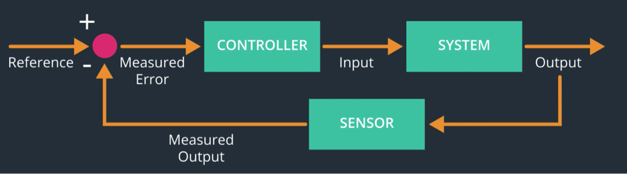
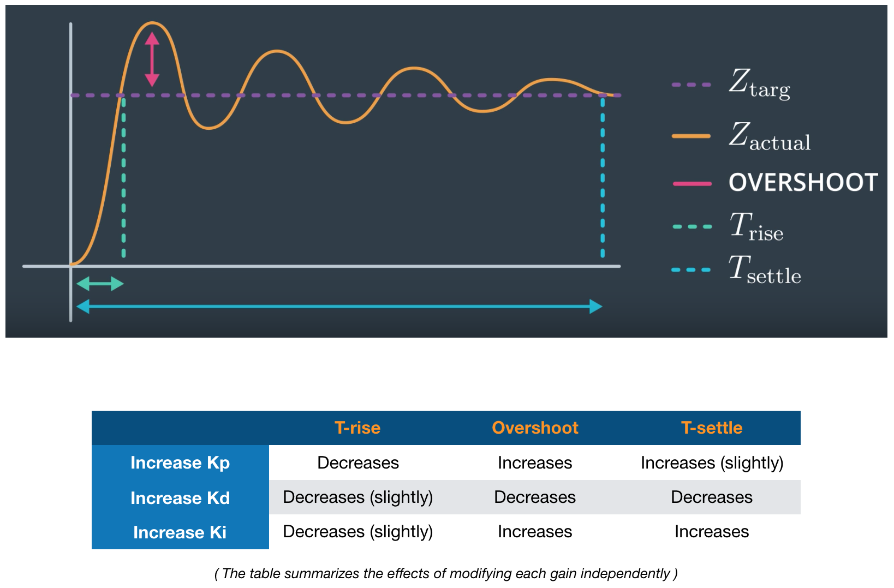
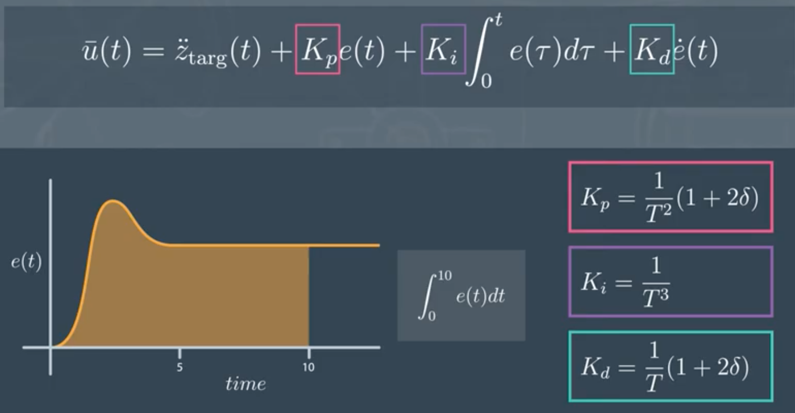
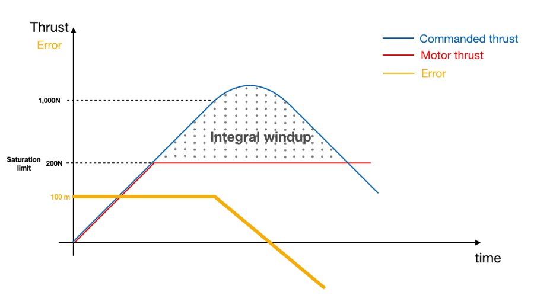
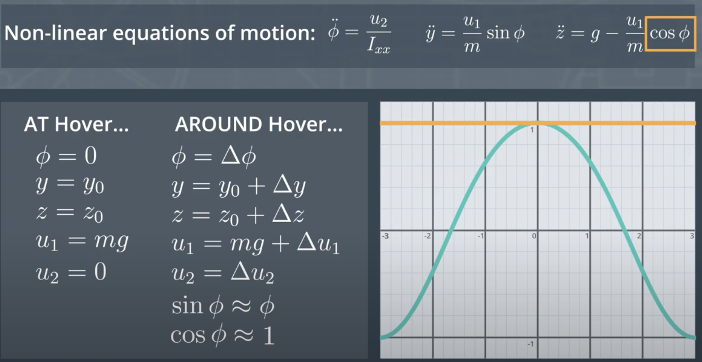
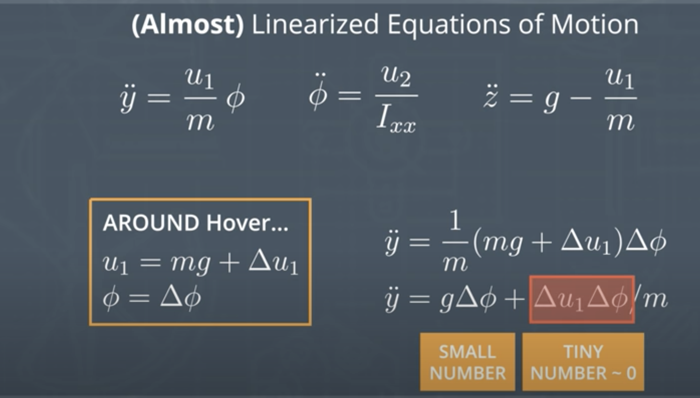
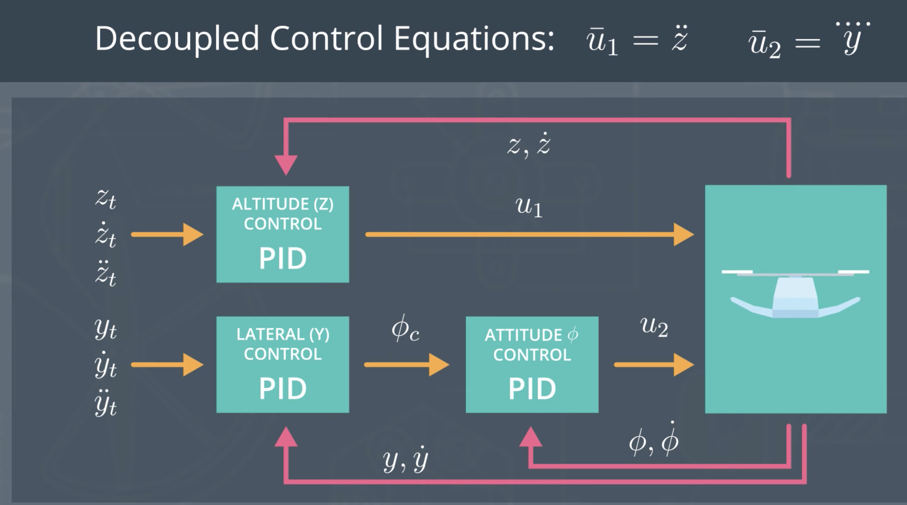
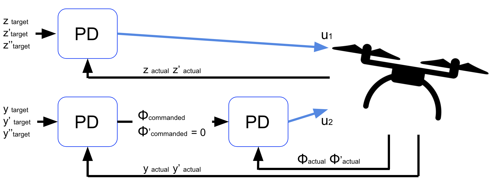

# 3D Quadcopter Controls

 

   
 

 

   
 

## Vehicle Dynamics

**Dynamics**: motion of bodies under the action of forces.

Example for a drone:
Inputs: rotation rates of the 4 propellers
Outputs: motion of the vehicle

1. Basic (1D) Quadrotor Physics

**Definition of Force**

Forces on a Quadrotor: gravity / weight, thrusts, drag. A force is simply a push or a pull on an object. Air resistance and drag will not be modelled. Drag is treated as a disturbance.

**Translational Equilibrium / Hover**

Translational equilibrium means no translational acceleration. A translation is any non rotational motion. The only way for an object to be in translational equilibrium is when net forces on the object are 0, i.e. for a monorotor to hover, any downward force (gravity) is balanced by an equivalent upward force (thrust)

Rotational Equilibrium is achieved when the body of the quadrotor is not rotating. It is achieved by setting spinning rates  of the clockwise rotor at the same speed as the counterclockwise rotor.

A clockwise rotor introduces a counterclockwise moment (noted M) or torque, and vice-versa.

$\omega$ is used to define the rotation rate of the propeller.
The force F and moment M of the propeller are proportional to $\omega^2$

$F = k_F.\omega^2$
$M = k_M.\omega^2$

It means that if we double the rotation speed of a rotor, the thrust change by a factor of 4.

The values for $k_F$ and $k_M$ are generally found empirically. We mount the motor and propeller on a load cell and measure the force and moment for different motor speeds.

Unbalanced forces cause acceleration. When an object experiences unbalanced forces, it accelerates in the direction of the net force.
Unbalanced forces => translational acceleration
Unbalanced moments / torques => rotational acceleration

F are vectors with direction and magnitude.

$$F = ma$$
F: net force
a: acceleration as measured in an inertia frame (reference frame that is not accelerating)

Torque is used interchangeably with moment. The general equation for torque is:
$\tau = I.\alpha$

* $\tau$ = net torque
* $\alpha$ = angular acceleration, expressed in radians / $s^2$
* I = moment of inertia, it is a measure of how hard it is to change an object's rotational velocity over a particular axis (x,y,x for pitch, roll and yaw). Can be different by axis.

For yaw in particular:

$\tau = I.\alpha$ is equivalent to $M_Z = I_Z.\ddot{\psi}$
The moment about the z axis will cause an acceleration in the psi coordinate

Controls problem:
Input: a desired trajectory (position, orientation)
OUtput: sequence of propeller turn rates that will cause the drone to fly that trajectory

Dynamics problem:
Input: a continuous sequence of propeller rotation rates
Output:trajectory

3 steps to move from rotation rates to position 

1. rotation rates => thrust $F_T$ and moments $M_X$, $M_Y$, $M_Z$
 $M_X$ total **moment** about the X-Axis that causes the drone to roll
 $M_Y$ total **moment** about the Y-Axis that causes the drone to pitch
 $M_Z$ total **reaction moment** about the Z-Axis that causes the drone to yaw
 
 angular acceleration: $\ddot \phi = \frac{M_X}{I_X}$ 
 
 with $I_X$ moment of inertia around the X-axis

2. $F_Z$ determines $\ddot z$ with $\ddot z = g - \frac{F_T.\cos\phi}{m}$
 
 also : $\ddot y = \frac{F_T.\sin\phi}{m}$

 $M_Z$ determines $\ddot \psi$ with $M_Z = I_Z.\ddot{\psi}$

3.  $\ddot z \rightarrow \int \rightarrow \int$
 
 $\ddot \psi \rightarrow \int \rightarrow \int$

## Vehicle Control

### PID Control

The three components (proportional, integral, derivative) contribute to the output of the controller, and we can decide how to weigh each contribution by adjusting the gain terms (Kp, Ki, Kd).

### Tuning Guidelines

**Steps:**

* Select a natural oscillation $\omega_n$ as high as possible
* Define $T = 1 / \omega$
* Choose the damping ratio $\delta$ between 0.7 and 1.0
* Calculate $K_P, K_I, K_D$

|PID gains|Formulas                   |
|---      |---                        |
|$K_P$    |$\frac{1}{T^2}(1+2.\delta)$|
|$K_I$    |$\frac{1}{T^3}$            | 
|$K_D$    |$\frac{1}{T}(1+2.\delta)$  |

### Integral windup
Integral windup, also known as integrator windup[1] or reset windup,[2] refers to the situation in a PID feedback controller where a large change in setpoint occurs (say a positive change) and the integral term accumulates a significant error during the rise (windup), thus overshooting and continuing to increase as this accumulated error is unwound (offset by errors in the other direction). The specific problem is the excess overshooting

We want to minimize this windup area, which means that we want to reduce the time it takes to reverse command when the error changes sign, to stop the integrator from increasing its output value. A way to do that is to use “clamping,” which essentially turns the integrator off when we don’t want it to integrate any longer.

## Control Architecture

### Underactuation and Coupling

In a 2D drone, there are 3 degrees of freedom: y, z, and $\phi$. As a reminder, $\phi$ is the roll angle. In order to control 2 variables, we have to sacrifice the 3rd one (underactuation). This is due to the fact that y and z motion are coupled through $\phi$. Any thrust will ve shared in the y and z directions, because $\ddot y$ and $\ddot z$ depend on $\phi$
2 control variables for 3 degrees of freedom => underactuated

### Linearization 2D dynamics

#### Taylor expansion

The fundamental idea of linearization is to approximate a non-linear equation locally (at a given point, called the operating point) by a linear equation, that has to pass-through the operating point and has the same slope at this point.

$f_{lin}(x) = f(x_{op}) + f'(x)|_{x=x_{op}}\Delta x$

For example, $x_op=1$, $f(x) = x^2$ => $f_{lin}(x) = f(1) + f'(x)|_{x=1}(x-1) = 1 + 2.(x-1) = 2x - 1$

This is the first order Taylor expansion around the operating point.

#### Operating Point

The choice of the operating point is an equilibrium state. At the equilibrium hover configuration, all the accelerations $\ddot z$, $\ddot y$, $\ddot \phi$ must be zero. This imposes some constraints on what values the other variables can take.

Recall that equilibrium is where we can find certain fixed and non-changing control inputs, where the velocities and accelerations in the y, z and psi dimensions are zero. Intuitively, this is the state where the vehicle stays for an extended period of time. For a quadrotor, the only state that is in equilibrium is called hover.

Around hover, we perform 3 approximations:

1. we approximate $\sin \phi = \phi$ 
2. we approximate $\cos \phi = 1$
3. we approximate $\ddot y = g.\phi$ because at hover, $u_1 = mg + \Delta u_1$ and $\phi = 0 + \Delta\phi = \Delta\phi$

We end up with the following linearized equations:

* $\ddot y = g\phi$
* $\ddot z = g - \frac{u_1}{m} = \bar u_1$
* $\ddot \phi = \frac{u_2}{I_{xx}} = \bar u_2$

Note that because setting y requires setting $\ddot y$ which requires to set $\phi$, $\bar u_2 = \ddddot y$

### Cascaded Control Architecture

The 2 equations $\bar u_1 = \ddot z$ and $\bar u_2 = \ddddot y$ are called decoupled control equations, as $U_1$ and $U_2$ control z and y.

The linearization of the motion equations enabled to decouple the motion.

### Review of 2D dynamics

1. Identify state $y, z, \phi, \dot y, \dot z, \dot \phi$

2. Identify Forces and Moments acting on the vehicle. Forces determined acceleration $\ddot y$ and $\ddot z$ and Moments determined angular acceleration $\ddot \phi$

3. y, z, and $\phi$ were calculated based on $\ddot y, \ddot z, \ddot \phi$ via double integration

## Full 3D Control

### Drone dynamics

Let's remember the movement that a drone can perform. It can move along the three position axis $x$, $y$ and $z$. We choose the $z$ axis to be directed downward. The drone also can roll along the $x$ axis, pitch along the $y$ axis and yaw along the $z$ axis. The directions of the rotations are depicted in the images above. 

We will have to **track the drone's change in attitude in two coordinate systems**. 

* One in an inertial frame (world frame) relative to the surroundings
* The second in the body frame attached to the drone itself.
 

### Tracking 3D Dynamics / State

In order to track the drone state, we will require 12 parameters which include $X = [x,y,z,\phi,\theta,\psi,\dot{x},\dot{y},\dot{z},p,q,r]$, where $x$, $y$, and $z$ are the special positions of the drone relative to the inertial frame (world frame) and $\dot{x}$, $\dot{y}$, and $\dot{z}$ translational velocities along these axes. $\phi$, $\theta$, and $\psi$ represent the drone's attitude in the inertial frame (world frame), while $p$, $q$ and $r$ capture the angular velocities in the body frame. 
Correspondingly the derivative of the state vector in time will have the next form:$\dot{X} = [\dot{x},\dot{y},\dot{z},\dot{\phi},\dot{\theta},\dot{\psi},\ddot{x},\ddot{y},\ddot{z},\dot{p},\dot{q},\dot{r}]$

|Variables             |Meaning                                                    |Frame   |Unit     |       
|---                   |---                                                        |---     |---      |  
|x, y, z               |Coordinates of the location (translational position)       |World   |m        |
|$\phi,\theta,\psi$    |Orientation or attitude for roll, pitch, yaw (euler angles)|World   |rad      |
|$\dot x,\dot y,\dot z$|Translational velocities in x, y and z                     |World   |m/s      |
|p, q, r               |Angular rotation rates about the x-axis, y-axis and z-axis |**Body**|rad/s    |

The World frame is also called the inertial coordinate system.

### Identify Forces and Moments acting on the vehicle (in body frame).

Translational motions from the Forces => $\ddot x, \ddot y, \ddot z$ will give us the (x,y,z) coordinates
Rotational motions from the Moments => $\dot p, \dot q, \dot r$ will give $\phi,\theta,\psi$

#### Forces

Let's define the forces generated by the propellers 
$F_1 = k_f\omega^2_1$, $F_2 = k_f\omega^2_2$, $F_3 = k_f\omega^2_3$, $F_4 = k_f\omega^2_4$. The collective force directed upward $F_{total} = F_1 + F_2 + F_3 + F_4$.

#### Moments

Moments are a measure of the turning effect of a force around a specified turning point or pivot. A moment is a force times a distance. The unit used to measure a moment is newton metres (Nm). The direction of a moment is opposite to the direction of the force. The convention is that:

* clockwise moments are positive
* anti-clockwise moments are negative.

Let's define the moments created by the propellers. 

For roll motion, the moments generated by the first and fourth propellers are counteracted by the moment generated by the second and the third propellers. The $l$ is a distance between x-axis and propeller location, which is equal to half of the distance between neighboring propellers. In the same fashion, the pitch is generated by the mismatch of the moments created by first and second propellers and the moment generated by the third and fourth propellers. 

Contrary to the roll and pitch the yaw motion is executed by the mismatch of the moments generated by the propellers along the $z$ axis by the reactive force. The moment generated by the propeller is directed opposite of its rotation and is proportional to the square of the angular velocities.  

$$
\begin{align}
\tau_x &= (F_1 + F_4 - F_2 - F_3)l \\
\tau_y &= (F_1 + F_2 - F_3 - F_4)l \\
\tau_z &= \tau_1 + \tau_2 + \tau_3 + \tau_4
\end{align}
$$

Where $\tau_1 = - k_m \omega^2_1$, $\tau_2 = k_m \omega^2_2$, $\tau_3 = -k_m \omega^2_3$, $\tau_4 = k_m \omega^2_4$. In our notation, the propellers 1 and 3 rotate in clockwise thus **producing the moment in the counterclockwise direction with negative sign **and propellers 2 and 4 rotate in counterclockwise thus the resulting moments are in opposite direction (clockwise) and have the positive signs.  

### From controller input to propeller angular velocities

#### Controller inputs

The controllers will have the following targets as inputs. A sequence of targets defines a trajectory.

* position coordinates $x_t, y_t, z_t$
* translational velocities $\dot x_t, \dot y_t, \dot z_t$
* yaw $\psi_t$
* optional: translational acceleration $\ddot x_t, \ddot y_t, \ddot z_t$

The controllers will have the following inputs / outputs:

|Controller   |Inputs - Targets                     |Inputs - Actuals                        |Outputs                 |Order|
|---          |---                                  |---                                     |---                     |---  |
|Altitude     |$z_t$, $\dot z_t$                    |$z$, $\dot z$, $\phi$, $\theta$, $\psi$ |$u_1$                   |2nd  |
|Lateral (x,y)|$x_t$, $\dot x_t$, $y_t$, $\dot y_t$ |$x$, $\dot x$, $y$, $\dot y$            |$\ddot x_c$, $\ddot y_c$|2nd  |
|Roll-Pitch   |$u_1$, $\ddot x_c$, $\ddot y_c$      |$\phi$, $\theta$, $\psi$                |$p_c$, $q_c$            |1st  | 
|Body Rate    |$p_c$, $q_c$, $r_c$                  |p, q, r                                 |$u_2,u_3, u_4 $         |1st  |
|Yaw          |$\psi_t$                             |$\psi$                                  |$r_c$                   |1st  |

### Fist vs. Second Order Systems

A first order system outputs the 1st derivative of its input, like the yaw controller (input $\psi$, output is a function of $\dot \psi$). A P controller is enough for a 1st order system.

A 2nd order system outputs the 2nd derivative of its input, like the altitude controller (input z, output $\ddot z$)
In order to control a 2nd order system, a PD controller is necessary. PID can be useful but can also be ignored.

The controller communicates the following values: $c$; $\bar u_p$; $\bar u_q$; $\bar u_r$.

Now based on the input from the controller we can set the angular velocities of the propellers. 

**VERTICAL ACCELERATION**
$\omega_1^2 + \omega_2^2 + \omega_3^2 + \omega_4^2 = \bar c$

**ROLL**
$\omega_1^2 - \omega_2^2 - \omega_3^2 + \omega_4^2 = \bar c$

**PITCH**
$\omega_1^2 + \omega_2^2 - \omega_3^2 - \omega_4^2 = \bar c$

**YAW**
$\omega_1^2 - \omega_2^2 + \omega_3^2 - \omega_4^2 = \bar c$

Let's solve these linear equations.
$$
\begin{pmatrix} 1 & 1 & 1 & 1 \\ 1 & -1 & -1 & 1 \\ 1 & 1 & -1 & -1\\ 1 & -1 & 1 & -1 \end{pmatrix} \times \begin{pmatrix} \omega^2_1 \\ \omega^2_2 \\ \omega^2_3\\ \omega^2_4 \end{pmatrix} = \begin{pmatrix} \bar{c} \\ \bar{p} \\ \bar{q} \\ \bar{r} \end{pmatrix}
$$

We need to transform the inputs from the controller into the $\bar{c}$, $\bar{p}$, $\bar{q}$, $\bar{r}$ variables.

The $c$ value received from the controller is equal to $\frac{F}{m} = c$, For equation $(\omega^2_1 + \omega^2_2 + \omega^2_3 + \omega^2_4) = \bar{c}$ the proper transformation will be $\bar{c} = \frac{F}{k_f} = \frac{c m }{k_f}$ (which transforms thrust in dimensionless form).

For roll, pitch and yaw $\bar{u}_p = \dot{p} = \frac{\tau_x}{I_x}$ , $\bar{u}_q = \dot{q} = \frac{\tau_y}{I_y}$ , $\bar{u}_r = \dot{r} = \frac{\tau_z}{I_z}$. Transforming them into dimensionless form 
$$
\begin{align}
\bar{p} &= \frac{I_x \bar{u}_p}{k_f l } \\
\bar{q} &= \frac{I_y \bar{u}_q}{k_f l } \\
\bar{r} &= \frac{I_z \bar{u}_r}{k_m } \\
\end{align}
$$

#### Transformation

Rotation matrix to transform coordinates from the body frame to the world frame

To transform between body-frame accelerations and world frame accelerations you will need to be able to generate the rotation matrix $R$ where:

$$R = R_z(\psi) \times R_y(\theta) \times R_x(\phi)$$

The $x$, $y$, and $z$ rotations are:
$$
\begin{alignedat}{1}R_{x}(\phi ) &={\begin{bmatrix}1&0&0\\0&\cos \phi &-\sin \phi \\[3pt]0&\sin \phi &\cos \phi \\[3pt]\end{bmatrix}}\\[6pt]R_{y}(\theta )&={\begin{bmatrix}\cos \theta &0&\sin \theta \\[3pt]0&1&0\\[3pt]-\sin \theta &0&\cos \theta \\\end{bmatrix}}\\[6pt]R_{z}(\psi )&={\begin{bmatrix}\cos \psi &-\sin \psi &0\\[3pt]\sin \psi &\cos \psi &0\\[3pt]0&0&1\\\end{bmatrix}}\end{alignedat}
$$

#### Calculate Linear accelerations

The linear accelerations along the $x$, $y$ and $z$ axes can be represented in matrix form where $g$ is an acceleration due to gravity which is directed along the $z$ axis. The $F$ is a total force generated by all four propellers and is directed upward in the body frame. We need to transform the force in the body frame into the inertial frame (world frame) by the rotation matrix R and divide the result by m to get the acceleration vector. 

$$
\begin{pmatrix} \ddot{x} \\ \ddot{y} \\ \ddot{z}\end{pmatrix}  = \begin{pmatrix} 0 \\ 0 \\ g\end{pmatrix} + \frac{1}{m}R \begin{pmatrix} 0 \\ 0 \\ -F_{total} \end{pmatrix} 
$$

where $R = R(\psi) \times R(\theta) \times R(\phi)$

#### Get $\dot{\omega}$  (which is just  $\dot{p}$, $\dot{q}$, $\dot{r}$)

Let's recall that the general form of Euler's equations is:

$
\mathbf{M = I \dot{\omega} + \omega \times (I\omega)} 
$

The angular acceleration in body frame can be calculated using the following equation. The expanded version is provided below as well. Where $p$ is a rate of roll in the body frame, $q$ is a rate of pitch in body frame and $r$ is the rate of yaw. All of these are measured in radians per second

$$
I\begin{pmatrix} \dot{p} \\ \dot{q} \\ \dot{r} \end{pmatrix} =\begin{pmatrix} \tau_x  \\ \tau_y  \\ \tau_z  \end{pmatrix} - \begin{pmatrix} p \\ q \\ r \end{pmatrix} \times I \begin{pmatrix} p \\ q \\ r \end{pmatrix}
$$

$$
I_x \dot{p} =  \tau_x - (I_z-I_y) r q \\
I_y \dot{q} =  \tau_y - (I_x-I_z) p r \\
I_z \dot{r} =  \tau_z - (I_y-I_x) q p \\ 
$$

Later in `advance_state` you will use $\dot{p}$, for example, to update $p$:

#### Getting the rate of change of the Euler angles

Instantaneous turn rate in the body frame to an instantaneous change in the Euler angles (world frame) is done with the matrix multiplication derived in the lesson. 
$$
\begin{pmatrix} \dot{\phi} \\ \dot{\theta} \\ \dot{\psi}\end{pmatrix} = \begin{pmatrix} 1 & \sin{\phi}\tan{\theta} & \cos{\phi}\tan{\theta} \\ 0 & \cos{\phi} & -\sin{\phi} \\ 0 & \sin{\phi}\sec{\theta} & \cos{\phi}\sec{\theta} \end{pmatrix} \times \begin{pmatrix} p \\ q \\ r \end{pmatrix}
$$

where $\sec{\theta} = \frac{1}{\cos{\theta}}$

### Tuning Controllers

We generally want to implement and tune the inner (and faster) controllers before worrying about the outer loops
Sequence of implementation for the controllers:

A good approach is to follow this sequence:

1. Body-rate controller
2. Roll-pitch controller
3. Altitude controller
4. Lateral controller
5. Yaw controller

