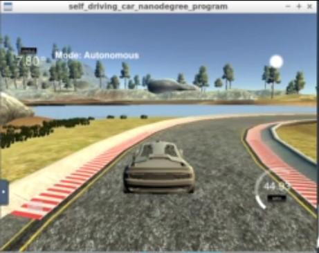
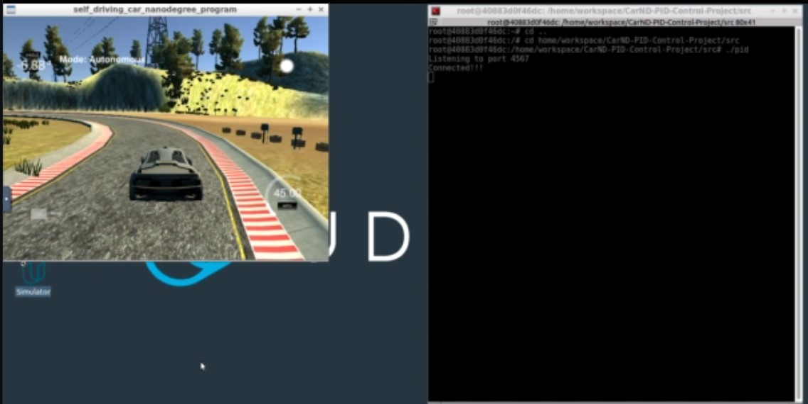

<h1 align="center">
  <br>
  </a>
</h1>

<h4 align="center">PID Control</h4>
<p align="center">
  <a href="#about">About</a> •
  <a href="#results">Results</a> •
  <a href="#installation">Installation</a> •
  <a href="#configuration">Configuration</a> •
  <a href="#references">References</a> •
  <a href="#credits">Credits</a> •
  <a href="#going-further">Going Further</a>
</p>

---
<h1 align="center">
  <br>
  <a href=""></a>
</h1>
<h5 align="center">2 PID controllers (speed and steering) with automatic tuning (twiddle)</h2>


## About

The objective of this project is to program in C++ a PID controller and tune its hyperparameters for a vehicle driving around a track in the Udacity simulator.
Hyperparameters tuning (Kp, Ki and Kd) were performed both manually and automatically via an algorithm called Twiddle.

### PID Algorithm

I implemented 2 PID controllers:
* Speed PID: the throttle value (input) regulates the speed (output). Maintaining a constant speed was important to better tune the steering PID as the hyper-parameters Kp, Ki and Kd apparently varies depending on speed. See Speed_PID.cpp and Speed_PID.h.
* Steering PID: the CTE (Cross_Track Error = Input) regulates the steering value (output between -1 and 1). See PID.cpp and PID.h

A PID controller is a control loop algorithm that continuously calculates the gap between the desired value and the actual value (error value at time t = e(t)) and computes a correction based on the following formula:
correction(t) = Kp * e(t) + Ki * Sum[e(0),e(1), ..., e(t)] + Kd * de(t) / dt

* P = Kp * e(t) is proportional to the error

* I = Ki * Ki * Sum[e(0),e(1), ..., e(t)] accounts for the systematic bias (sum of cumulative past values of the errors in a discretionized environment), like some mechanical defaults or wind resistance for speed.

* D =  Kd * de(t)/dt accounts for the rate of error change, so it anticipates the future trend of the error (reduces oscillation in case of steering)

### Steering PID Tuning
I started by a manual tuning of the hyper-parameters:
* Kp (proportional component) between 0.1 and 0.2 until the vehicle oscillates
* Then, I tuned Kd (derivative) to reduce oscillations
* Finally, I tuned the Ki to correct systematic bias. I particularly monitored if the integral value (sum of CTE over time) would stabilize after a certain number of steps (I expect negative and positive CTE values to offset each other when the PID controller stabiilzes)

I also implemented the Twiddle algorithm to perform an automated tuning of the hyper-parameters. In main.cpp, line 67, twiddle_switch must equal to true in order to activate the Twiddle algorithm.

The code is located in a function of the PID class, called Twiddle(). For each parameter tuning, there are 6 stages:
* Stage 1: increment the parameter (Kp, Ki or Kd) by dp
* Stage 2: measurement of the error (sum of absolute values of CTE over time) after stage 1 - only measurements around the target speed were considered.
* Stage 3: assessment of the error. Is it lower than previous best error? 
  * If yes, dp is increased by 10% and back to Stage 1.
  * If no, the parameter is decreased by 2 dp and next stage is stage 4.
  *
* Stage 4: measurement of the error after stage 3 (just in case the error value was not lower than the previous best error).
* Stage 5: assessment of the error. Is it lower than previous best error?
   * If yes, dp is increased by 10%
   * If no, dp is reduced by 10%

* Stage 6: This stage is automatically activated when a minimum number of iterations has been done on all the PID parameters.
 
Note that the simulator resets in case the vehicles goes more than 2.5m away from the center (line 106 in main.cpp)

## Results

### The vehicle was able to drive safely until a speed of 55 mph with the following hyperparameters:
|Speed (in mph)   | Kp [propoprtional]        | Ki [Integral]  | Kd [Derivative]  |
|---|---|---|---|
| 35  | 0.125       | 0.000286  | 1.01681  |
| 45  | 0.126  | 0.0003  | 1.1  |
| 55  | 0.115  | 0.002  | 1.3  |

I also tested the PID controller at 75mph but could not find appropriate parameters while driving safely and maintaining a constant speed. By introducing a brake function (braking when CTE > threshold, i.e. when the vehicle is about to go off track, was necessary to keep the vehicle on track).

Please refer to the video "Video Recording 2020-09-01.mov".


## Installation

## Testing Environment
Udacity's workspace was used exclusively. Simulator's settings are 640 x 480 screen resolution and fastest graphics quality.

## Dependencies

* cmake >= 3.5
 * All OSes: [click here for installation instructions](https://cmake.org/install/)
* make >= 4.1(mac, linux), 3.81(Windows)
  * Linux: make is installed by default on most Linux distros
  * Mac: [install Xcode command line tools to get make](https://developer.apple.com/xcode/features/)
  * Windows: [Click here for installation instructions](http://gnuwin32.sourceforge.net/packages/make.htm)
* gcc/g++ >= 5.4
  * Linux: gcc / g++ is installed by default on most Linux distros
  * Mac: same deal as make - [install Xcode command line tools]((https://developer.apple.com/xcode/features/)
  * Windows: recommend using [MinGW](http://www.mingw.org/)
* [uWebSockets](https://github.com/uWebSockets/uWebSockets)
  * Run either `./install-mac.sh` or `./install-ubuntu.sh`.
  * If you install from source, checkout to commit `e94b6e1`, i.e.
    ```
    git clone https://github.com/uWebSockets/uWebSockets 
    cd uWebSockets
    git checkout e94b6e1
    ```
    Some function signatures have changed in v0.14.x. See [this PR](https://github.com/udacity/CarND-MPC-Project/pull/3) for more details.
* Simulator. You can download these from the [project intro page](https://github.com/udacity/self-driving-car-sim/releases) in the classroom.

Fellow students have put together a guide to Windows set-up for the project [here](https://s3-us-west-1.amazonaws.com/udacity-selfdrivingcar/files/Kidnapped_Vehicle_Windows_Setup.pdf) if the environment you have set up for the Sensor Fusion projects does not work for this project. There's also an experimental patch for windows in this [PR](https://github.com/udacity/CarND-PID-Control-Project/pull/3).

## Basic Build Instructions

1. Clone this repo.
2. Make a build directory: `mkdir build && cd build`
3. Compile: `cmake .. && make`
4. Run it: `./pid`. 

Tips for setting up your environment can be found [here](https://classroom.udacity.com/nanodegrees/nd013/parts/40f38239-66b6-46ec-ae68-03afd8a601c8/modules/0949fca6-b379-42af-a919-ee50aa304e6a/lessons/f758c44c-5e40-4e01-93b5-1a82aa4e044f/concepts/23d376c7-0195-4276-bdf0-e02f1f3c665d)

The project is buildable using cmake and make
   
## Configuration

Please see code in `main.cpp` and `pid.cpp`

## References

* None

## Credits

* Udacity [Self-Driving Car Engineer Nanodegree](https://www.udacity.com/course/self-driving-car-engineer-nanodegree--nd013) program.  

## Going Further

Future improvements:
* The automatic tuning of the steering PID could be further improved by iterating over a stable environment (like one lap, a constant speed, after the PID controller stablilizes)
* the integral value of the PID component could be preset so that it reduces the time for stabilization.
* Hyper-parameters could be dynamically adjusted according to speed.

PID controller looks pretty efficient in the test case scenario until max 65mph but lacks any anticipation related to the path perception and the car trajectory is not smooth enough. I understand that a Model Predictive Control (MPC) would be more appropriate.


