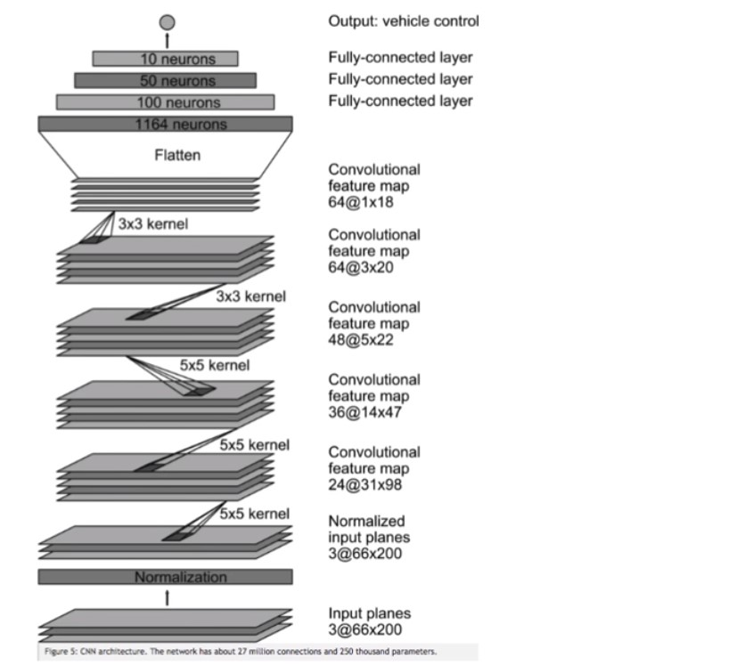
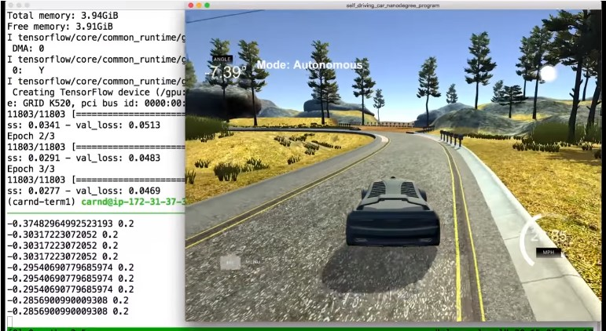

<h1 align="center">
  <br>
  </a>
</h1>

<h4 align="center">Behavioral Cloning</h4>
<p align="center">
  <a href="#about">About</a> •
  <a href="#results">Results</a> •
  <a href="#installation">Installation</a> •
  <a href="#configuration">Configuration</a> •
  <a href="#references">References</a> •
  <a href="#credits">Credits</a> •
  <a href="#going-further">Going Further</a>
</p>

---
<h1 align="center">
  <br>
  <a href=""></a>
</h1>
<h5 align="center">End-to-end learning of steering angles from images</h2>


## About


The goals / steps of this project are the following:
* Use the simulator to collect data of good driving behavior
* Build, a convolution neural network in Keras that predicts steering angles from images
* Train and validate the model with a training and validation set
* Test that the model successfully drives around track one without leaving the road

My project includes the following files:
* model.py containing the script to create and train the model
* drive.py for driving the car in autonomous mode
* model11.h5 (video run3.mp4) and model111.h5 (video run2.mp4) containing a trained convolution neural network 

### Model Architecture and Training Strategy

My model is inspired by the NVidia end-to-end model (https://developer.nvidia.com/blog/deep-learning-self-driving-cars/) 
Note that I also included dropout layers to mitigate overfitting risks.
The model also includes RELU layers to introduce nonlinearity.

The 160x320 RGB images are pre-processed in Keras by:
* cropping to 65 x 320 x 3
* normalizing values between -0.5 and 0.5 using a Keras lambda layer

I did not use grayscaling but instead introduce 1x1 convolutions to let the model choose the best color space.

#### 2. Attempts to reduce overfitting in the model

The model contains dropout layers in order to reduce overfitting.
The model was trained and validated on different data sets to ensure that the model was not overfitting. The model was tested by running it through the simulator and ensuring that the vehicle could stay on the track.

#### 3. Optimizer

The model used an Adam optimizer.

#### 4. Training data

Training data was chosen to keep the vehicle driving on the road. I used a combination of center lane driving, recovering from the left and right sides of the road. Data provided by Udacity proved to be more efficient to train the model.
Model11.h5 is trained with 5 epochs of Udacity Data
Model111.h5 is trained with 2 epochs of Udacity data and 4 epochs of personal data (see My_IMG)

For details about how I created the training data, see the next section. 

### Model Architecture and Training Strategy

#### 1. Solution Design Approach

The overall strategy for deriving a model architecture was to use a convolution neural network model similar to the Nvidia model. I adjusted it with:
* 1*1 convolution for color space
* Dropout for reducing overfitting

At the end of the process, the vehicle is able to drive autonomously around the track without leaving the road.

#### 2. Final Model Architecture

The final model architecture consisted of a convolution neural network with the following layers and layer sizes:
* 3 1*1 convolution layers (for color space)
* 5 convolution layers with depths of 24, 36, 48, 64 and 64 using 5x5 kernels for the first 3 layers and 3x3 kernels for the last 2 layers
* I added dropout layers after the 1st and 2nd layer
* After flattening the last convolutional layer, I added 3 fully-connecter layers (100,50,10)
* The final output of the regression model is the steering angle of the vehicle

Here's below the final architecture with RGB images of input shape = 160 x 320 x 3
| Layers (type)  |Output Shape   | 
|---|---|
| cropping2d_1 (Cropping2D)  |   (None, 65, 320, 3)   |   
|lambda_1 (Lambda)   |  (None, 65, 320, 3)   |  
|conv2d_1 (Conv2D)   |  (None, 65, 320, 3)  |   
| conv2d_2 (Conv2D)  | (None, 31, 158, 24)   |   
| dropout_1 (Dropout)  | (None, 31, 158, 24)  |   
| conv2d_3 (Conv2D)   |   (None, 14, 77, 36)  |   
| dropout_2 (Dropout)   |  (None, 14, 77, 36) |   
| conv2d_4 (Conv2D)   |  (None, 5, 37, 48)  |   
| conv2d_5 (Conv2D)   | (None, 3, 35, 64)  |   
| conv2d_6 (Conv2D)    |  (None, 1, 33, 64)  |   
|flatten_1 (Flatten)     |  (None, 2112)  |   
| dense_1 (Dense)   | (None, 100)  |   
| dense_2 (Dense)    |    (None, 50) |   
| dense_3 (Dense)      |  (None, 10) |   
|   dense_4 (Dense)    | (None, 1)   |   


#### 3. Creation of the Training Set & Training Process

To capture good driving behavior, I first recorded two laps on track one using center lane driving (see My_IMG folder). Data provided by Udacity proved to be better than my own driving data. I only used Track 1 data.

To augment the data set, I included a few more images:
* left camera image with a steering angle adjusted by +0.25
* right camera image with a steering angle adjusted by -0.25
* 2 more images with random brightness, shadow and flip effects (steering direction inversed if flipped).

I did not change the orientation of images since I would have had to tune the steering angle, which is equivalent to tell the model how much to turn, whereas the objective is to let the model figure it out by itself.

I finally randomly shuffled the data set and put 20% of the data into a validation set. 

I used Udacity-provided and personal training data for training the model. The validation set helped determine if the model was over or under fitting. The ideal number of epochs was 5 epochs (Udacity data only - model11.h5) or 2 + 4 epochs (Udacity data + personal training data - model111.h5),  as evidenced by the validation set accuracy. I used an adam optimizer so that manually training the learning rate wasn't necessary.

## Results

* run2.mp4 is the video produced with model111.h5 (Udacity + personal data, 2 + 4 epochs)

* run3.mp4 is the video produced with model11.h5 (Udacity data only, 5 epochs)


## Installation

## 
   
## Configuration

Using the Udacity provided simulator and the `drive.py` file, the car can be driven autonomously around the track by executing 
```sh
python drive.py model11.h5
```
or
```sh
python drive.py model111.h5
```

The model.py file contains the code for training and saving the convolution neural network. The file shows the pipeline I used for training and validating the model, and it contains comments to explain how the code works.

## References

* NVidia end-to-end model (https://developer.nvidia.com/blog/deep-learning-self-driving-cars/) 

## Credits

* Udacity [Self-Driving Car Engineer Nanodegree](https://www.udacity.com/course/self-driving-car-engineer-nanodegree--nd013) program.  

## Going Further

The project could be further developed by:
* collecting more data (2nd track), (for example, including sharper turns and slope)
* better balancing data according to steering angles (to mitigate the bias to go straight)
* more augmented data
* predicting the throttle and speed data by introducing them in the model or configuring them in the controller (drive.py)