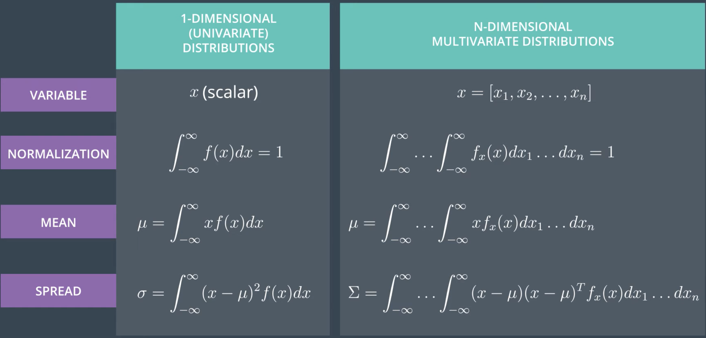
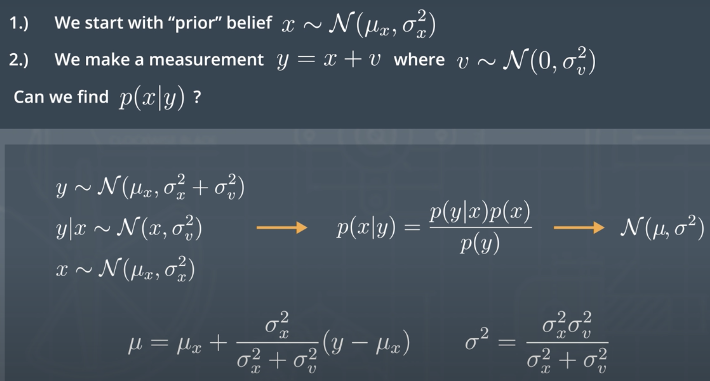
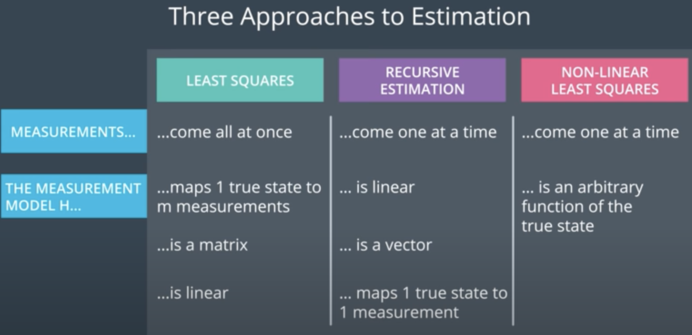
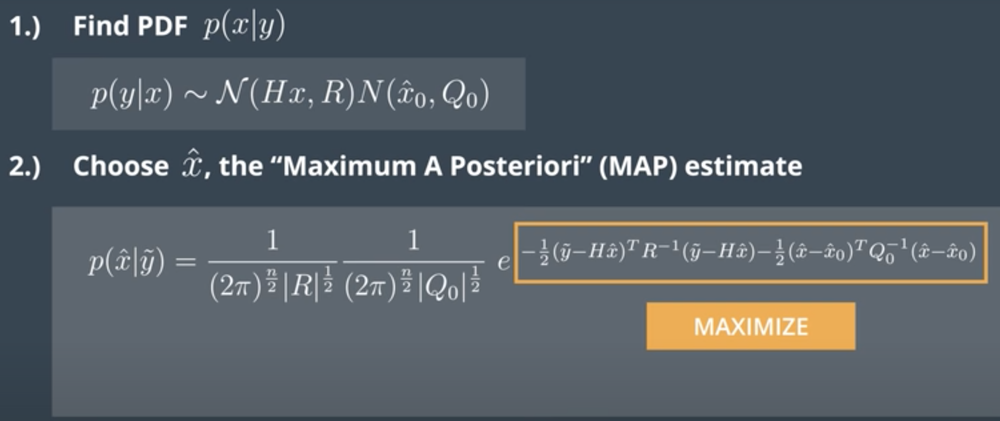
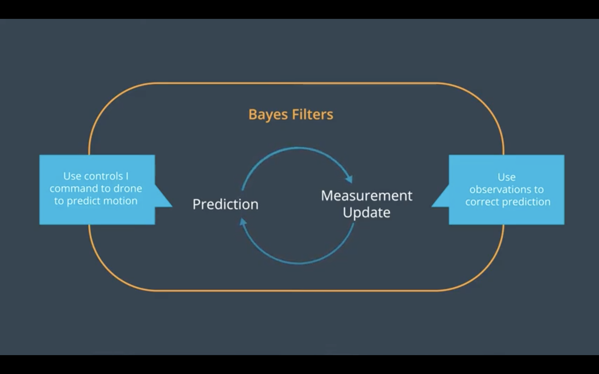
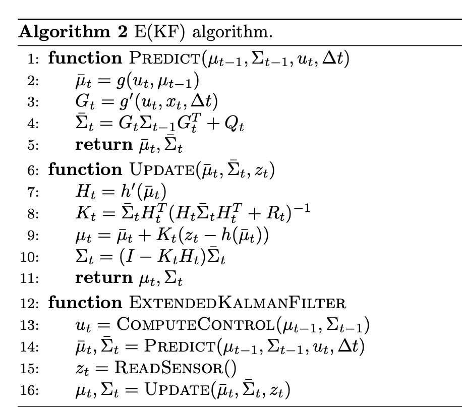

# Estimation

Here's a few notes from Udacity courses. Please refer to the Self-Driving Car ND projects for more details on filter implementations.

## Introduction

### Multivariate distributions

### Joint and marginal distributions

**Joint Distribution** - The joint distribution p(x,y) gives the probability of event x and event y happening. This idea can be generalized to situations with more than two random variables as well.

**Marginal Distribution** - The marginal distribution of a subset of random variables gives the probability distribution over just the variables in that subset.

For example, let's say you know the probability distribution on a vehicle's x,y,z location in space: 
p(x,y,z), but you only care about the vehicle's altitude (z). You could compute the marginal distribution for z by integrating out the other two variables.
$p(z) = \int^{\infty}_{\infty}\int^{\infty}_{\infty}p(x,y,z)dxdy$

**Independence** - Two events x and y are independent when their joint probability is equal to the product of the individual probabilities. That is, when: p(x,y)=p(x)p(y)

**Correlation**: When two random variables are correlated, knowledge of one provides some information about the other. For example, the position of a vehicle now and the position of a vehicle in one second are correlated random variables: knowledge of one should give me some insight into the value of the other.

The Pearson correlation coefficient is one way of quantifying this relationship.

**Covariance**: Covariance is related to correlation. It is a measure of the joint variability of two random variables. If one variable tends to be big when the other is big, then the covariance is positive. The correlation coefficient is simply the normalized version of the covariance.

**Bayes' Rule**: When we do estimation for a flying vehicle, we generally have access to the measurements y and we want to know the probability of x given those measurements. So we want to calculate 
p(x∣y). But it turns out that it's often MUCH easier to generate the distribution of measurement likelihoods given the current position. That is, it's easier to come up with p(y∣x) than it is to come up with p(x∣y). This is where Bayes' Rule is really helpful! According to Bayes' Rule:
$p(x∣y)= \frac{p(y)}{p(y∣x)p(x)}$
​	 
​	 

Note that the new mean estimate $\mu$ can be interpreted as an update of the old/initial mean estimate $\mu_x$. The higher the new measurement noise ($\sigma^2_v$), the more we can trust the prior estimate $\mu_x$. On the contrary, a low measurement noise will cause a more significant update of the initial estimate, towards the new measurement y.

### Approaches to estimation

#### Variable Reference
The following table explains the significance of some of the variables we'll be using.

|Variable|Meaning|
|---       |---|
|x         |The unknown (and constant) state vector|
|H         |The (linear) measurement model. Projects or maps a state into measurement space. Perfect measurement of the state would yield Hx.|
|v         |The noise which corrupts our measurements. It's sampled from a zero-mean normal distribution.|
|R         |	The covariance of the measurement noise|
|m         |The number of measurements made.|
|n         |The size of the state vector x|
|$\tilde y$|The actual noisy measurements.|

$measurement = H.x$ => $x = H^{-1}.measurement$

#### Three Approaches (for non-stationary vehicles)

1. Least-Squares and maximum likelihood

We'll use least squares to estimate a state vector $x$, given $m$ noisy measurements derived from:
$
\tilde{y} = Hx + v
$

$v$ is sampled from gaussian $v \sim \mathcal{N}(0, R)$, and $H$ is a matrix mapping the state space to the measurement space. We'll assume x is constant, meaning the vehicle is currently not moving.

Thus you'll want to select an estimate of the state $x$, $\hat{x}$ which maximizes the likelihood of the observed measurements $\tilde{y}$:

$
p(y = \tilde{y} | x = \hat{x})
$

**Step 1**: find the probability density function (PDF) of p(y/x). It will give us the likelihood of measurement y when the state is x.

We calculate that $y|x \sim \mathcal{N}(H.x, R)$

It means that $p(\tilde y |x) = \frac{1}{K}e^{F(x,\tilde y)}$

with $K = (2.\pi$^{n/2}R^{1/2}  - it is a normalizer.
and $F(x,\tilde y) = -0.5.(\tilde y - H.x)^T.R^{-1}(\tilde y - H.x)$

We want to maximize $F(x,\tilde y)$. We take the derivative, set it to 0 and solve for x.

We find that $\hat x = (H^T.H)^{-1}H^T\tilde y$

**Step 2**: choose $\tilde x$

2. Recursive Estimation (Maximum A Posteriori - MAP)

We now assume we have a prior estimate before a new measurement. $x \sim \mathcal N(\hat x_0, Q_0)$

Note that we find $\hat x$ by taking the function in the exponent, calculating its derivative and finding the solution when the derivative is equal to 0.

The result is a new Gaussian distribution with an updated mean and covariance.

$p(\hat x\ | \tilde y) \sim \mathcal {N}(\hat x_1, Q_1)$

The updated parameters of the gaussian are:

* covariance $Q_1 = (Q_0^{-1} + H^TR^{-1}H)^{-1}$
* mean $\hat x_1 = \hat x_0 + Q_1H^TR^{-1}(\tilde y - H.\hat x_0)$

We can think of the Maximum A Posteriori (MAP) estimate $\hat x_1$ as the weighted average between the prior $\hat x_0$ and the new measurement (update form: $x_{new} = x_{old} + \alpha (x_{new} - x_{old})$ with $\alpha$ as a function of the prior covariance and the measurement covariance). So 2 consequences:

* the more we trust our measurements, the more we will update the state;  
* the smaller the measurement covariance (less uncertain), the more we will update the state

## Sensors

Concepts to go further:

* Method of moments
* Multivariate distributions - Eigen values
* Pearson Product Moment correlation $\rho_{12}= \frac{cov(x1, x2)}{\sigma_1 x \sigma_2}$
* Coriolia force

Uncorrelated data does not imply independence, unless the variables are gaussian. X1 and X1 have to be jointly gaussian. for jointly Gaussian random variables, uncorrelated implies independence. if 2 variables are marginally Gaussian and uncorrelated, they are not necessarily independent.

linalg.inv(a)
Compute the (multiplicative) inverse of a matrix.
linalg.pinv(a[, rcond, hermitian])
Compute the (Moore-Penrose) pseudo-inverse of a matrix.

Navigation by integration => dead-reckoning (highly suscptible to drift)

## Extended Kalman Filter

See previous projects implementation.

### Bayes filter

As a reminder, the principle of the bayes filter is to estimate the state through:

1. a **prediction** of the state, based on the current state and a control (e.g. velocity)
Note that **a transition model** converts the current state into a predicted state. Because the transition model includes noise, it **increases uncertainty** (drift if we keep on predicting without updating the state).

2. an **update** of the state, based on the predicted state and a measurement
Note that a **measurement model** converts the predicted state into the updated state (based on a measurement). This update always **decreases uncertainty**.

In practice, the prediction step and update step are executed as callback functions when the vehicle receives a control command and a new measurement respectively.

### Kalman filter and Extended Kalman Filter

The Kalman Filter and Extended Kalman Filter make the assumption that the distributions over belief state are Gaussian, represented as a mean and covariance matrix. Compare to the Bayes’ filter, the distributions
bel and $\bar{bel}$ are represented as a mean and covariance matrix. The KF assumes that the transition and observation models are linear, and can be defined by a matrix. The EKF is the extension to the nonlinear case, where we take use the Jacobian matrix of the transition and observation functions to compute a point- wise linear estimate, and then do the same updates as the Kalman Filter. We define the Extended Kalman Filter (EKF) algorithm following Thrun et al. [13]. We refactor it to include separate Predict and Update methods and to use our notation. We also unify the KF and EKF algorithm pseudocode. The transition or prediction covariance is Qt; the measurement covariance is Rt. These matrices are often taken to be constant, but also sometimes people change them over time depending on the sensor model.

The EKF and KF are closely related. For the KF, the matrix Gt is constant every iteration of the function and does not need to be recomputed each time (except for ∆t). Another way to say it is the implementation of g′ ignores its state input. Similarly, for the KF, the matrix Ht is constant every iteration of the function and does not need to be recomputed. Another way to say it is the function h′ ignores its state input. For the EKF, these matrices change each iteration, because it linearizes around the current state.

## 3D Estimation

|States element                         |Estimation|
|---                                    |---|
|$x, y, z, \dot x, \dot y, \dot z, \psi$|EKF (or UKF)|
|p. q. r                                |Gyro mesurements|
|$\phi, \theta$                         |complementary filter|

Challenges in 3D:

* state vectors are big! 7 variables imply a 49 derivatives calculation for the Jacobian

* More sensors: each sensore needs a measurement model h

* 3D transforms between body frame and world frame are difficult