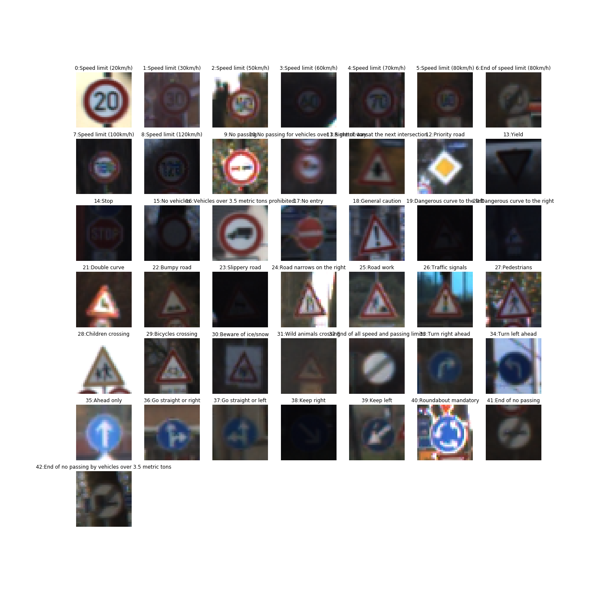

[//]: # (Image References)

[image1]: ./readmefiles/all_traffic_signs.png "Visualization"

<h1 align="center">Traffic Sign Recognition</h1>
<p align="center">
  <a href="#about">About</a> •
  <a href="#results">Results</a> •
  <a href="#installation">Installation</a> •
  <a href="#configuration">Configuration</a> •
  <a href="#references">References</a> •
  <a href="#credits">Credits</a> •
  <a href="#going-further">Going Further</a>
</p>

---

<h1 align="center">
  <br>
  <a href="https://github.com/VinBots/robots_clp"></a>
</h1>
<h5 align="center">Traffic signs detection</h2>

## About

The project is to classify traffic signs from the [German Traffic Sign Dataset](https://benchmark.ini.rub.de/?section=gtsrb&subsection=dataset)

The steps are the following:
* Load the data set (see below for links to the project data set)
* Explore, summarize and visualize the data set
* Design, train and test a model architecture
* Use the model to make predictions on new images
* Analyze the softmax probabilities of the new images
* Summarize the results with a written report


## Results

I used the numpy and pandas library to calculate summary statistics of the traffic signs data set:
* Number of training examples = 34799
* Number of testing examples = 12630
* Number of validation examples = 4410
* Image data shape = (32, 32, 3)
* Number of classes = 43

### Preprocessing

 * convert the images to grayscale (simply by averaging the 3 channels)
 * normalize the image data


### Model architecture

My final model consisted of the following layers:

| Layer         		|     Description	        					| 
|:---------------------:|:---------------------------------------------:| 
| Input         		| 32x32x1 grayscaled/normalized image   		| 
| Convolution 3x3     	| 1x1 stride, same padding, outputs 32x32x50 	|
| RELU					|ReLu Activation								|
| Max pooling	      	| 2x2 stride,  outputs 16x16x64 				|
| Convolution 3x3     	| 1x1 stride, same padding, outputs 32x32x75 	|
| RELU					|ReLu Activation			    				|
| Max pooling	      	| 2x2 stride,  outputs 16x16x64 				|
| Fully connected		|1875 x 120 with droput = 0.5       		    |
| Fully connected		|120 x 84 with dropout = 0.5        		    |
| Fully connected		|84 * 43 classifier.        				    |


### Model Training

Here's the parameters I used in my model:
* Adam optimizer
* EPOCHS = 10
* BATCH_SIZE = 50
* rate = 0.0006
* keep_prob_value=0.5


### Approach taken for finding a solution and getting the validation set accuracy to be at least 0.93

My final model results were:
* training set accuracy of 99.6%
* validation set accuracy of 96.0% 
* test set accuracy of 94.0%

Here's my approach for selecting an architecture:
* I started with the LeNet-5 architecture
* I significantly increased the depth of the 2 convolutional layers (75 and 50)
* I included a dropout of 0.5 to reduce overfitting

I also tried to add a skip layer between the convolution1 layer and the classifier
=> it did not create significant improvements so I removed it
 
I experimented also with the GoogLeNet architecture (inception module) and adjusted it for a simplified version with only 1 inception module (GooLeNet.ipynb). The validation accuracy was 96% with 10 epochs.


Note: test a saved model from scratch

I implemented the code below to be able to test the model from a new environment, which required not only to import saved data but the model structure (with the function import_meta_graph). It required to rigorously name the tensors of the models in order to fetch them later, especially the input and output tensors.
In particular, I found very useful to use tf.name_scope to arrange the naming
with tf.name_scope("conv_layer1"):
    with tf.name_scope('weights'):
        conv1_W = tf.Variable(tf.truncated_normal(shape=(5, 5, 1, depth_conv1), mean = mu, stddev = sigma),name='W1')

```
import tensorflow as tf
tf.reset_default_graph()
with tf.Session() as sess:
    saver = tf.train.import_meta_graph(model_name + ".meta")
    saver.restore(sess, model_name)
    ys = sess.graph.get_tensor_by_name('input/labels:0')
    xs = sess.graph.get_tensor_by_name('input/images:0')
    keep_prob = sess.graph.get_tensor_by_name('input/keep_prob:0')
    v_xs=X_test
    v_ys=y_test
    prediction = sess.graph.get_tensor_by_name('fc_layer3/output/classifier:0')
    y_pre = sess.run(prediction, feed_dict={xs: v_xs, ys: v_ys, keep_prob: 1})
```

### Test a Model on New Images

I used 2 sets of images: 1 easy and another 1 more difficult (see Jupyter Notebook)
Easy set are stored in Im1, Im2, ..., Im5
Difficult set are stored in Image1, Image2, ..., Image5

In particular, I found out that:
* properly cropping and centering the image significantly improves the recognition performance. 
* Changes of perspective are significantly disturbing the model (see Traffic signal).


The results of the difficult set prediction are shown below

| Image			             |     Prediction	        				| 
|:---------------------:|:---------------------------------------------:| 
| Traffic Signal      		| Wild Animals Crossing   					| 
| Road work     			| Road work 								|
| Keep Right				| Keep Right								|
| Speed Limit 60      		| Speed Limit 30			 				|
| No Entry			        | No Entry				        			|


The model was able to correctly guess 3 of the 5 traffic signs, which gives an accuracy of 60%, well below the accuracy of the test set.


The code for making predictions on my final model is located in the Jupyter notebook.

All the images for which the predictions are correct have a 100% probability, whereas the 2 wrong ones have a probability of 95% and 80%, which is still very high for a wrong prediction!

Also some wrong predictions are linked to the under-representation of some classes, like the traffic signal image (only 1.55% of the training data sets), which probably created overfitting. Data augmentation would have improved this situation.


## Installation

Please refer to the instructions at the root of the repository

## Configuration

Refer to the files ``

## References

* None 

## Credits

* Udacity [Self-Driving Car Engineer Nanodegree](https://www.udacity.com/course/self-driving-car-engineer-nanodegree--nd013) program.  

## Going Further

* Data augmentation - see tutorial: https://www.tensorflow.org/tutorials/images/data_augmentation
* Live detection in a video
