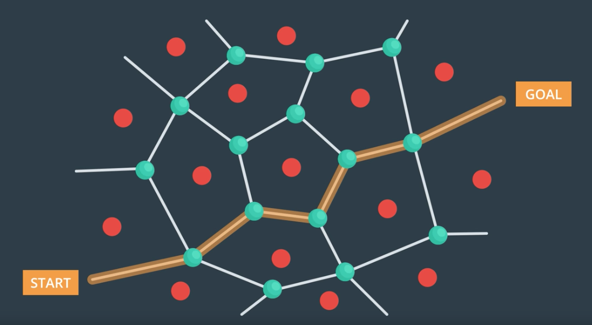

<h1 align="center">
  <br>
  </a>
</h1>

<h4 align="center">3D Motion Planner</h4>
<p align="center">
  <a href="#about">About</a> •
  <a href="#theory">Theory</a> •
  <a href="#installation">Installation</a> •
  <a href="#configuration">Configuration</a> •
  <a href="#references">References</a> •
  <a href="#credits">Credits</a> •
  <a href="#going-further">Going Further</a>
</p>

---
<h1 align="center">
  <br>
  <a href=""></a>
</h1>
<h5 align="center">Finding the optimal plan in a complex urban environment</h2>


## About

The objective is to plan a path through a complex urban environment.


I build a motion planner using a 2-step approach:

* High-level planning, based on a low-resolution graph, using Voronoi points and A* search algorithm
* (Optional) Receding horizon planning, based on a high-resolution grid and A* search algorithm

I also included the ability to choose a goal location according to, by priority order, geodetic coordinates, north-east coordinates with a global home position defined as longitude: -122.397450, latitude: 37.792480. In case geodetic and north-east coordinates are set to None, a random goal location will be searched by the program

Note that, in order to be valid, a goal location must meet 3 conditions:

* be separated by a minimum distance to the start location (set at 100m byu default)
* the landing zone must be safe, i.e. even surface within 2 meters
* the landing altiitude must be within the parameters defined in self.landing_altitude_min and self.landing_altitude_max. By default between 0 and 10m. It is a convenient feature to select a goal location on top of a roof (e.g. self.landing_altitude_min = 2)

Finally, the landing at the goal location triggers the reduction of the deadband (from 5 to 0.5) so that the landing is more accurate.

**Code**: the class MotionPlanning included a plan_path() method that I replaced by a plan_initial_path() method that is part of a more general start-up routine defined in init_routine(self). This method is run after the drone is armed so that we can retrieve the current start location. The start-up routine includes:

* the loading of a 2.5D map (including safety distance)
* the loading of a landing grid (without safety distance, to enable more precise landing)
* Start location initialization by retrieving the local position
* Goal location initialization as described above
* Initialization of the target altitude and landing altitude (can be higher than 0)
* Building of the graph
* Building of the path from start to goal location

This start-up routine generates waypoints from start to goal.

**home position**: see init_start(self)

**local position**: after setting the global home, we can use self.local_position

**start location**: it is defined as the current location

**goal location**: we can define either a geodetic coordinate, a north-east coordinate or ask for a random location.

**search**: I implemented A* algorithm on a graph (high-level planning) and on a high-resolution grid (receding horizon).

**pruning**: I used collinerarity test for removing waypoints

**testing**: the drone is able to fly to most of safe landing zone. Note that some locations are not accessible or obstacles are sometimes not exhaustively included in colliders.csv.

## Theory

### Planning as Search

### Representation of the planning problem

* search state space: one solution is tho discretize the state space and build a grid representaiton of the world, including the obstacles.
* start state and goal state
* actions that define how the vehicle can move from state to state
* Costs associated with each possible action


### Flying Car Representation

#### Geodetic frame

Latitude and longitude on the globe define what's known as the geodetic frame. The geodetic frame is a spherical coordinate system where r, theta $\theta$ and phi $\phi$ are represented by altitude, longitude and latitude.


#### Local ECEF

We'll convert to a local ECEF (Earth-centered Earth-fixed) frame with x,y,z coordinates:

* x points North
* y points East
* z points Down

This North-East-Down (NED) coordinate frame is the most common local frame used in aereonautics.

#### From Geodetic (e.g. GPS) to Local ECEF (x,y,z)

UTM stands for Universal Transverse Mercator and it's a common coordinate system used in all kinds of mapping applications for describing positions on the earth in Cartesian coordinates. 

We are concerned with the actual UTM coordinates of the vehicle, but rather, the difference in the position, or the position of some obstacle relative to a "global home" position or origin. In principle, we could define our global home position to be anywhere, but it usually makes the most sense to define home as either where your vehicle starts off from or some other local home base position.


The UTM system divides the surface of the Earth into a number of zones that look like this:
There are 60 numbered UTM zones covering the entire globe in the east-west direction and 24 zones labeled with letters of the alphabet from south to north. UTM coordinates are in units of metres, and your position within any zone is given as "eastings" and "northings", which you can think of as your position in metres along the east-west and north-south axes, respectively.

With the Python `utm` library, you can quickly find the zone number and letter as well as easting and northing for a particular latitude and longitude (given in decimal degrees)

Please refer to Geodetic to NED jupyter notebook.

#### Motions as transformation

A motion can be decomposed in:

* a translation to the reference point: $x_b' = x_b + x_t$
* a rotation to the reference rotation point: $v_o' = q_{\theta}.v_o.\bar{q}_{\theta}$


#### Configuration space

The configuration space that defines the free points and unfeasible points takes into account:

* the physical size of the vehicle
* the obstacles in the environment

In general, flying robots have six degrees of freedom, three translational and three rotational. So the configuration space for a flying vehicle is six dimensional (dimensionality = degrees of freedom).

We can also simplify reduce the congiguration space dimensionality by simply adding a margin of infeasible space around all obstacles, such that no matter the orientation of the vehicle you won't collide with obstacles.


### From Grids to Graphs

#### Grid-Techniques

1. Waypoint extraction

We can transform a sequence of grid cells into a sequence of waypoints, using collinearity. 3 points are collinear if the area formed by these points is equal to 0.
For three points p1, p2, p3​ to be collinear, the determinant of the matrix that includes the coordinates of these three points as rows must be equal to zero. For points in three dimensions this is a necessary but not sufficient condition for collinearity. 

2. Ray Tracing

The problem of the collinearity approach is that it does not produce the optimal path (it does not cut across cells). 
The issue with Ray Tracing is the floating point calculation that needs to be converted into integer (grid coordinates are integer)

3. Bresenham

#### Graph Tradeoffs

In the comparison below, we assume a low resolution for grid-based methods and a sufficient number of nodes for metric graphs.

|                          |Non-metric Graphs|Metric Graphs|Grids|
|---                       |---              |---          |---  |
|Complete                  |hard to know     |Yes          |Yes  |
|Optimal                   |hard to know     |Yes          |Yes  |
|Computationnally-expensive|No               |No           |Yes  |


#### Voronoi Graph and Medial Axis


A **Voronoi diagram** is a partition of a plane into regions close to each of a given set of objects. In the simplest case, these objects are just finitely many points in the plane (called seeds, sites, or generators). For each seed there is a corresponding region consisting of all points of the plane closer to that seed than to any other. These regions are called Voronoi cells.

The **medial axis method** is an **image processing technique** for identifying a "skeleton" of a binary image, or in this case, the grid map of obstacles and free space. We'll be using the medial_axis() transform method within the the Scikit-Image library. This method returns the one-pixel-wide skeleton of the image so for instance, when you run it on the grid you've created of the environment from the previous exercises, it looks like this:


#### Random Sampling

Sampling the environment at random might seem like a strange idea, but it's actually a relatively efficient way to build up a set of feasible states through the free space. By implementing random sampling of a 3D environment, we can generate candidate nodes for a graph representation of the state space.

The process to generate a set of feasible states will be to first scatter points at random throughout the environment over some range in x, y, and z. Then for each of those points, we'll test whether it lies inside the ground plane polygon of any obstacles, and if so, whether or not it is above or below the height of the obstacle.

We'll then discard points that are in collision with obstacles, or in other words, those that lie within the ground plane polygon of an obstacle and below the height of that obstacle. And what we're left with are a collection of states that lie in the free space!

#### Probabilistic Roadmap

The algortihm consists in 3 stages:

* sample states at random
* discard states that collide with obstacles
* build a graph and run search

In the limit of the number of samples, we are guaranteed to converge to a path that is both:

* asymptotically complete (find all the feasible paths)
* asymptotically optimal (find the best path)

The **KD Tree** is a **space-partitioning data structure**, which allows for fast search queries. The KD Tree achieves this by cutting the search space in half on each step of a query. If you're familiar with "big O notation", this brings the total search time down to O(m∗log(n)) from O(m∗n), where m is the number of elements to compare to and n is the number of elements in the KD Tree. So for example, if you want to find the closest neighbor to a single point, m=1 and n is equal to the total number of potential neighbors.

The Python Scikit-Learn (sklearn) library has an easy to use implementation of KD Trees that we'll be introducing in this exercise.

## Installation

### Step 1: Download the Simulator
This is a new simulator environment!  

Download the Motion-Planning simulator for this project that's appropriate for your operating system from the [simulator releases respository](https://github.com/udacity/FCND-Simulator-Releases/releases).

### Step 2: Set up your Python Environment
If you haven't already, set up your Python environment and get all the relevant packages installed using Anaconda following instructions in [this repository](https://github.com/udacity/FCND-Term1-Starter-Kit)

### Step 3: Clone this Repository
```sh
git clone https://github.com/udacity/FCND-Motion-Planning
```
   
## Configuration

### Step 1: Test setup
The first task in this project is to test the [solution code](https://github.com/udacity/FCND-Motion-Planning/blob/master/backyard_flyer_solution.py) for the Backyard Flyer project in this new simulator. Verify that your Backyard Flyer solution code works as expected and your drone can perform the square flight path in the new simulator. To do this, start the simulator and run the [`backyard_flyer_solution.py`](https://github.com/udacity/FCND-Motion-Planning/blob/master/backyard_flyer_solution.py) script.

```sh
source activate fcnd # if you haven't already sourced your Python environment, do so now.
python backyard_flyer_solution.py
```
The quad should take off, fly a square pattern and land, just as in the previous project. If everything functions as expected then you are ready to start work on this project. 

### Step 2: Inspect the relevant files
For this project, you are provided with two scripts, `motion_planning.py` and `planning_utils.py`. Here you'll also find a file called `colliders.csv`, which contains the 2.5D map of the simulator environment. 

### Step 3: Inspect  `motion_planning.py` and `planning_utils.py`

## References

* None

## Credits

* Udacity [Flying Car and Autonomous Flight Engineer Nanodegree](https://www.udacity.com/course/flying-car-nanodegree--nd787) program. 

## Going Further

* the receding horizon planner is in 2 dimensions and slows down the simulator. Reduction of the grid size and replanning frequency is necessary. I should investigate more efficient methods. Note that I implemented a simple method that works wells (line 442) that consists in going straight from the current location to the intersection between the receding planner grid and the next waypoint outside the horizon grid.

* A 3D approach could be interesting, even if the simulator does not seem to enable high altitude so we could fly over the buildings. The slowness of the simulator could be an issue.


